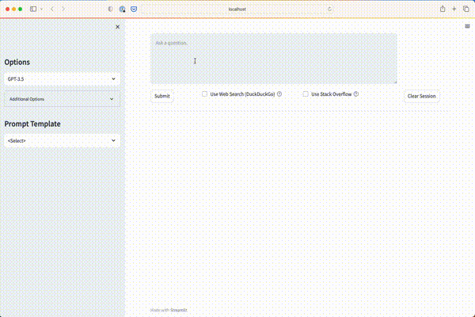

This streamlit app gives basic chat functionality using the [llm-chain package](https://github.com/shane-kercheval/llm-chain) and OpenAI.




Features:

- text streaming
- switch between GPT-3.5 and GPT-4
- shows token usage and costs for individual messages and aggregate across all messages
- has options for web-search (via DuckDuckGo) and searching Stack Overflow (adds the search results to a local vector database which is used to inject the most relevant content into the prompt)
- Allows users to create and select prompt-templates (`chat/source/prompt_templates`)

## Running

- Create a `.env` file in the project directory (i.e. same directory as this README file) in the format below. This file is used by `app.py` to load the key/value pairs as environment variables.
    - In order to use the `Use Stack Overflow` flag, you must have an entry for the `STACK_OVERFLOW_KEY` environment variable. Create an account and app at [Stack Apps](https://stackapps.com/) and use the `key` that is generated (not the `secret`). Otherwise you, can omit
    
```
OPENAI_API_KEY=....
STACK_OVERFLOW_KEY=...
```

- `make docker_run`
- open browser to `http://localhost:8501`

## Prompt Templates

- Prompt templates allow the user to quickly create different prompts by filling in information from the required fields. For example, the prompt `Create doc strings` requires a python function and then wraps that function in a predefined prompt. 
- prompt templates are defined in yaml files located in `source/prompt_templates`. Adding a new yaml file will automatically add the prompt to the drop-down in the app.

# Feature Improvements

- [ ] track conversation history (i.e. cache `Session`s)
- [ ] add settings to adjust DuckDuckGoSearch options
    - [ ] number of web-search results to scrape and store (default is 3)
    - [ ] size of document chunks (default is 500 characters)
    - [ ] number of documents chunks to insert into prompt (default is 3)
- [ ] `total_tokens` might not match `prompt_tokens` plus `response_tokens`. If there are other types of tokens used, for example, tokens used for embeddings.
- [ ] add settings and code to control memory e.g `llm_chain.memory.MemoryBufferMessageWindow`
- [ ] when using `cmd + enter` shortcut during the first message, streaming doesn't work; it works on all subsequent messages
- [ ] BUG: Once you modify the chat message, the prompt template message will not fill the text-box. Steps to reproduce: 
    - fill out fields in prompt template; hit "Create Message"; the chat message is updated
    - change one or more fields in the prompt template; hit "Create Message"; the chat message is still updated, as expected
    - modify the chat message
    - now click "Create Message" from prompt template; Chat message will not update
    - however, if you change one or more of field values in the prompt template and hit "Create Message" then the chat message will update as expected.
